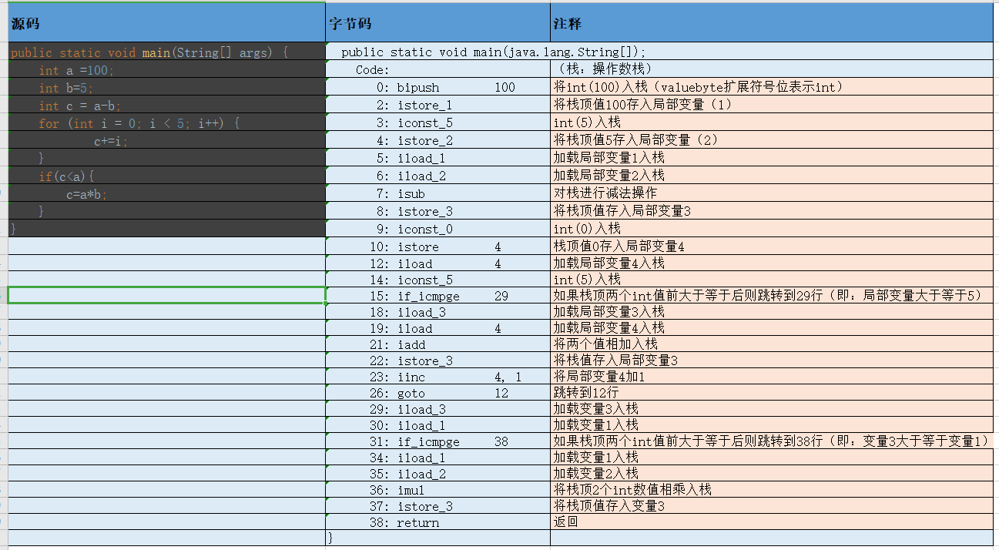
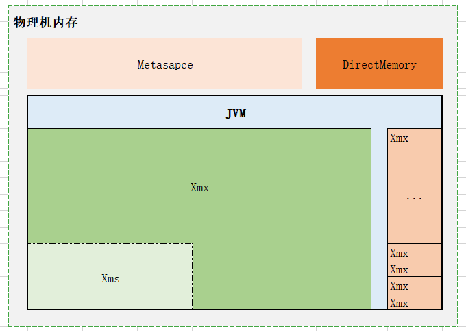

# 第一周作业
1. （选做）自己写一个简单的 Hello.java，里面需要涉及基本类型，四则运行，if 和 for，然后自己分析一下对应的字节码，有问题群里讨论。


> 参考链接：
https://www.cnblogs.com/longjee/p/8675771.html

2. （必做）自定义一个 Classloader，加载一个 Hello.xlass 文件，执行 hello 方法，此文件内容是一个 Hello.class 文件所有字节（x=255-x）处理后的文件。文件群里提供。
```java
public class Xlass2ClassLoader extends ClassLoader{

    public static void main(String[] args){
        Xlass2ClassLoader xlass2ClassLoader = new Xlass2ClassLoader();
        try {
            Class helloClass = xlass2ClassLoader.findClass("Hello.xlass");
            Method helloMethod = helloClass.getDeclaredMethod("hello");
            helloMethod.invoke(helloClass.newInstance());
        } catch (Exception e) {
            e.printStackTrace();
       }
    }

    @Override
    protected Class<?> findClass(String name) throws ClassNotFoundException {
        DataInputStream in = new DataInputStream(Xlass2ClassLoader.class.getClassLoader().getResourceAsStream(name));
        try {
            int length = in.available();
            byte[] decodeBytes = new byte[length];
            for (int i=0;i<length;i++){
                decodeBytes[i]=(byte)(255-in.readByte());
            }
            in.close();
            return defineClass("Hello",decodeBytes,0,length);
        } catch (IOException e) {
            e.printStackTrace();
        }
        return super.findClass(name);
    }
}
```

3. （必做）画一张图，展示 Xmx、Xms、Xmn、Meta、DirectMemory、Xss 这些内存参数的关系。

| 参数名称 | 含义 | 默认值|
| :--- |:---|:---|
|Xmx |最大堆大小 |主机物理内存1/4|
|Xms |初始堆大小 |主机物理内存1/64|
|Xmn |年轻代大小 |XX:NewRatio设置年轻与老年代占比|
|Meta |元空间 默认不限制|
|DirectMemory |堆外内存 |（NIO部分再细化）|
|Xss |每个线程堆栈大小 |默认1M|

> 示意图:
